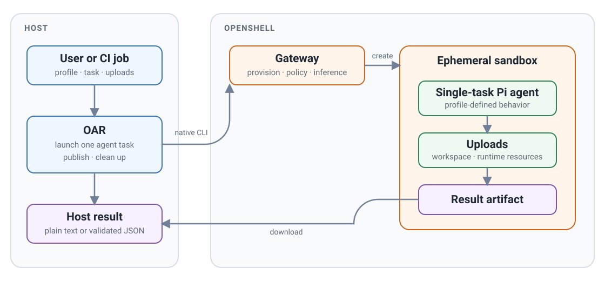
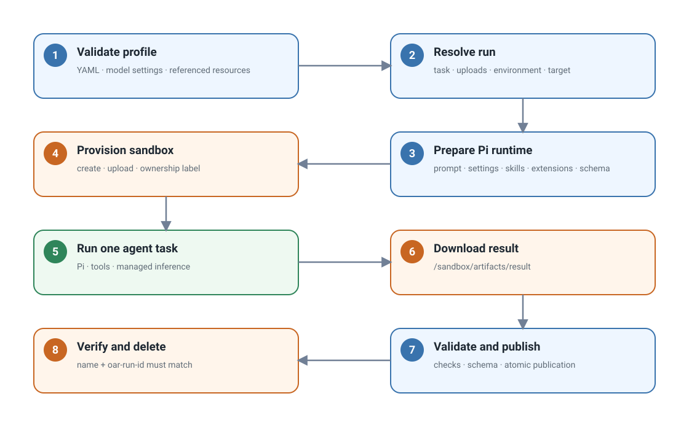
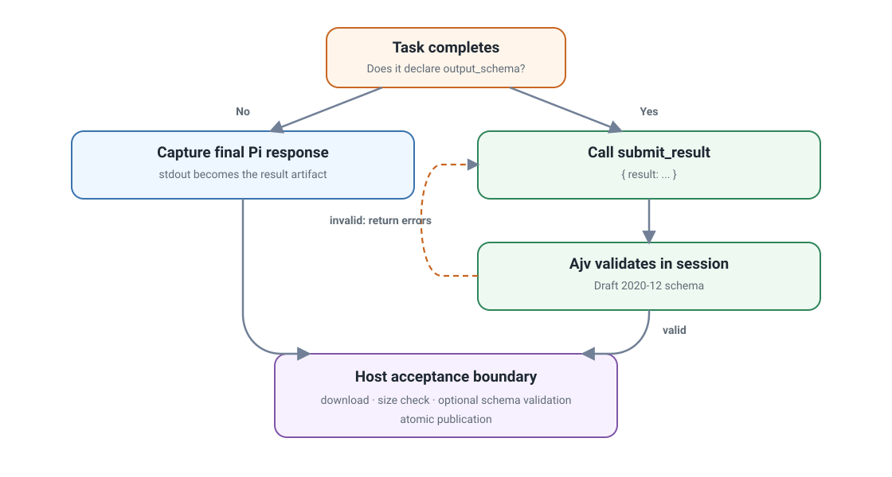

# Launch ephemeral agents with OpenShell Agent Runner (OAR)

OpenShell Agent Runner (OAR) is a CLI for launching an ephemeral agent to
accomplish one configurable task. Each `oar run` creates an isolated OpenShell
sandbox, starts Pi with the selected profile, publishes one result, and removes
the sandbox. The agent exists only for that run, making OAR well suited to CI
jobs and other automated workflows.

## Requirements

- [`uv`](https://docs.astral.sh/uv/).
- OpenShell 0.0.111 or newer.
- A running OpenShell gateway that the host can reach.
- An inference route and its model ID.

OAR uses this existing OpenShell configuration. It does not create gateways,
providers, workspaces, inference routes, or credentials. It uses the gateway's
`default` workspace unless you select another one. An OpenShell workspace is a
gateway-side namespace for sandboxes, inference routes, and access controls; it
is not the `/workspace` directory inside a sandbox.

## Run the starter task

Choose the model ID configured on your inference route. Create every profile
packaged with OAR, then check the gateway:

```bash
export MODEL_ID="provider/model"

uvx --from openshell-agent-runner oar init ./profiles \
  --model "$MODEL_ID"
uvx --from openshell-agent-runner oar doctor --gateway openshell
```

Validate the included profile, then preview the run without creating a sandbox:

```bash
printf '# Review me\n\nA short document.\n' > document.md
uvx --from openshell-agent-runner oar validate ./profiles/reviewer

uvx --from openshell-agent-runner oar run ./profiles/reviewer \
  --task review-document \
  --gateway openshell \
  --input document.md \
  --output /tmp/oar-review.md \
  --dry-run
```

Remove `--dry-run` to launch the agent. A successful run writes the review to
`/tmp/oar-review.md`. Replace `provider/model` with the route's model ID and
`openshell` with your gateway name.

`init` copies packaged profiles into an ordinary local directory so they can be
inspected, edited, and committed. Omit `--profile` to create all packaged
profiles. Use repeatable `--profile NAME` options to select a subset. The
required `--model` value is written into Pi's model registry and runtime
selection; OAR does not read `MODEL_ID` implicitly. Use `--thinking LEVEL` to
override the default `high` thinking level, or `--thinking off` when the model
does not support reasoning.

## Why OAR fits CI

This bounded lifecycle is designed for CI and other automated workflows: a job
can provide explicit inputs, run one review or transformation, consume the
result, and finish without maintaining a long-lived agent service. The profile
defines the task behavior through its prompt, tools, skills, extensions,
uploads, model settings, and sandbox policy.

Profiles can be versioned with the repository, while stable exit codes and an
explicit output path make the result available to later job steps. The CI worker
must have access to an existing OpenShell gateway and inference route; OAR does
not provision providers or credentials.

<figure class="documentation-figure documentation-figure--wide">
  
  <figcaption>One CLI invocation launches one ephemeral agent, produces one result, and cleans up.</figcaption>
</figure>

## Profile inputs

A profile directory is the complete task configuration:

```text
profile/
├── profile.yaml       Task, sandbox policy, tools, skills, and extensions
├── models.json        Pi provider and model definition
├── settings.json      Pi model selection and thinking level
├── policy.yaml        OpenShell sandbox policy
├── prompts/           Task instructions
├── schemas/           Optional result schemas
├── skills/            Optional Pi skills
└── extensions/        Optional Pi extensions
```

The CLI supplies run-specific values:

- `--task` selects a task from `profile.yaml`.
- `--upload SOURCE:DESTINATION` uploads a file or directory using OpenShell's
  native mapping format. It may be repeated.
- `--input PATH` supplies the file or directory required by the selected task.
  A `document` input is uploaded beneath `/workspace/input` with its ordinary
  file extension preserved. A `repository` input is uploaded beneath the same
  directory. OAR sets `REPOSITORY_ROOT` to the resulting document or repository
  directory.
- `--prompt-var NAME=VALUE` supplies a non-secret runtime prompt variable. It
  may be repeated for tasks that declare more than one variable.
- `--env KEY=VALUE` adds a sandbox environment value.
- `--gateway` selects an existing OpenShell gateway.
- `--workspace` selects a gateway-side OpenShell namespace. It defaults to
  `default` and is unrelated to the sandbox's `/workspace` directory.
- `--output` selects the host result path.
- `--timeout-seconds` limits the agent run.

Environment keys start with a letter or underscore and contain only letters,
digits, and underscores. They cannot start with OpenShell's reserved
`OPENSHELL_` prefix.

### Prompt variables

Tasks can declare string variables used by their prompt template:

```yaml
tasks:
  review-repository:
    required_input: repository
    prompt: prompt-repository.md
    prompt_variables:
      focus:
        description: Files or directories that deserve special attention.
        default: Review the entire repository.
      context:
        description: Additional context that should inform the review.
```

Variables with defaults are optional; variables without defaults are required.
Callers can supply several independent values by repeating the option:

```bash
--prompt-var focus="src/auth and tests/auth" \
--prompt-var context="Pre-release security review"
```

Templates reference declared variables by name and OAR metadata through the
reserved `oar` namespace:

```markdown
Inspect `{{ oar.input_path }}`, originally provided as
`{{ oar.input_name }}`.

Focus: {{ focus }}
Context: {{ context }}
```

Tasks with required inputs receive `oar.input_path` and `oar.input_name`.
Substitution is literal: prompt templates do not support expressions,
conditionals, loops, or shell evaluation. Unknown, duplicated, missing, unused,
and malformed variables are rejected before the sandbox starts.

### Tools and extensions

Each task lists the tools Pi may use. OAR accepts Pi's built-in `bash`, `edit`,
`find`, `grep`, `ls`, `read`, and `write` tools. Declare a custom tool alongside
the extension that provides it:

```yaml
tasks:
  check:
    prompt: prompts/check.md
    tools: [read, custom_check]
    extensions:
      - path: extensions/custom-check.ts
        tools: [custom_check]
```

Validation rejects unknown tools, missing extension files, and custom tools
without a matching extension declaration. Before inference starts, OAR checks
the tools Pi actually registered. A misspelled built-in or an extension that
fails to register its declared tool stops the task instead of silently removing
the tool.

## Run lifecycle

<figure class="documentation-figure documentation-figure--wide">
  
  <figcaption>One run launches one ephemeral agent in one sandbox and produces one published result.</figcaption>
</figure>

The sequence is:

1. Load `profile.yaml`, `models.json`, and `settings.json`; validate every
   referenced local resource.
2. Resolve the selected task, uploads, environment, gateway, workspace, and
   output path.
3. Prepare a temporary Pi runtime bundle containing the prompt, model files,
   configured skills and extensions, and optional output schema.
4. Create a persistent sandbox with the packaged image context, sandbox policy,
   and ownership label, then upload the task inputs and prepared runtime files.
5. Run `/opt/oar/pi/exec.sh` with `openshell sandbox exec`. Inside the sandbox,
   the script installs the Pi settings, changes
   to `REPOSITORY_ROOT`, and passes the prompt to `pi --print` through standard
   input:

   ```bash
   pi --print ... < /sandbox/oar-runtime/prompt.md
   ```

6. Pi reads uploaded files, uses its declared tools, and accesses inference
   through OpenShell's managed inference path.
7. OAR downloads `/sandbox/artifacts/result` under a one-MiB file limit,
   validates it, and atomically replaces the requested host output.
8. OAR verifies the sandbox name and `oar-run-id` ownership label before
   deleting it. `--keep-sandbox` skips this cleanup.

## Uploads

OAR uses OpenShell's term **upload** for files transferred into the sandbox.
General uploads accept files or directories:

```bash
--upload ./document.md:/workspace/document.md
--upload ./repository:/workspace
```

OpenShell treats a directory destination like `cp`: it creates the source
directory beneath that destination. Uploads run in declaration order, so more
than one source can intentionally merge into the same destination.

The packaged reviewer uses task-specific required inputs:

```bash
oar run ./profiles/reviewer \
  --task review-document \
  --input ./document.md \
  --output ./document-review.md

oar run ./profiles/reviewer \
  --task review-repository \
  --input ./repository \
  --prompt-var focus="src/auth and tests/auth" \
  --prompt-var context="Pre-release security review" \
  --output ./repository-review.md
```

Document tasks require a file and repository tasks require a directory. For a
repository task, OAR makes the uploaded repository the agent's working
directory. The repository is an uploaded snapshot; changes inside the sandbox
are disposable and are not synchronized back to the host.

Uploads come from three places:

| Source | Contents |
| --- | --- |
| Profile | `sandbox.upload` mappings shared by every run |
| CLI | Repeatable `--upload` mappings and the task's required `--input` |
| OAR | Prompt, Pi model settings, skills, extensions, and optional schema |

Caller uploads normally live under `/workspace`. OAR runtime uploads live under
`/sandbox/oar-runtime`, and results live under `/sandbox/artifacts`. Both
`/sandbox` paths are reserved for OAR. Uploaded workspace changes are disposable
and are not synchronized back to the host.

## Result handling

<figure class="documentation-figure documentation-figure--wide">
  
  <figcaption>A task chooses plain output by default or structured output by declaring an output schema.</figcaption>
</figure>

Without `output_schema`, Pi's final headless response becomes the result. OAR
requires it to be present, non-empty, and no larger than one MiB.

With `output_schema`, OAR automatically loads its built-in Pi extension and
adds the generic `submit_result` tool to the agent session. Profiles do not need
to provide this extension themselves. The tool uses TypeBox for its Pi tool
parameters and Ajv for Draft 2020-12 validation. Invalid submissions return
diagnostics to Pi, which can correct and resubmit inside the same agent session.
OAR validates the downloaded JSON against the same schema again before
publishing it.

Both validators treat extension keywords and JSON Schema `format` values as
annotations. OAR rejects `pattern` and `patternProperties` because Python and
JavaScript use different regular-expression dialects. Use portable structural
keywords such as `type`, `enum`, `const`, length, and numeric bounds instead.
OAR also rejects `$ref`, `$dynamicRef`, and `$recursiveRef` because the built-in
submission tool nests the schema under its `result` parameter. Inline the
referenced schema definitions.

The schema belongs to the profile. OAR has no built-in review or other
task-specific result type.

## Native command sequence

A normal run uses OpenShell's native sandbox operations in this order:

```text
openshell sandbox create ...
openshell sandbox upload ...
openshell sandbox exec ...
openshell sandbox download ...
openshell sandbox get ...
openshell sandbox delete ...
```

The upload command is repeated for each task input and runtime file.

Use `--dry-run` to print the complete generated commands and host actions
without creating a sandbox.

## Security boundaries

Use `--env` only for non-secret values. Credentials belong in OpenShell's
provider and inference configuration, not in profiles or command arguments.
Review uploads before sending private files to a remote gateway; uploaded files
and sandbox changes are disposable and are not synchronized back to the host.
OAR downloads only the task result. Its transport and optional schema checks
validate the result's shape, not the truth of agent-produced claims.

## Failure boundaries

| Exit code | Meaning |
| --- | --- |
| `0` | The result was validated and published. |
| `1` | OpenShell execution, timeout, missing remote output, download size limit, ownership inspection, or cleanup failed. |
| `2` | CLI input or profile configuration was invalid. |
| `3` | A downloaded result was empty, invalid, or failed its schema. |

## Develop OAR

From `projects/openshell-agent-runner`, run the full local checks and build both
package distributions:

```bash
make check
make build
```

Use `make test PYTEST_ARGS="tests/test_config.py"` for a focused test and
`make clean` to remove generated build and cache files. The local PyPI workflow
is documented in
[RELEASING.md](https://github.com/NVIDIA/OpenShell-Research/blob/main/projects/openshell-agent-runner/RELEASING.md).
